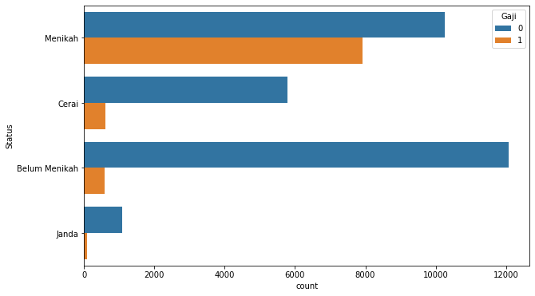
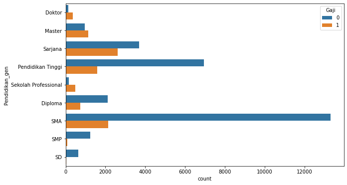
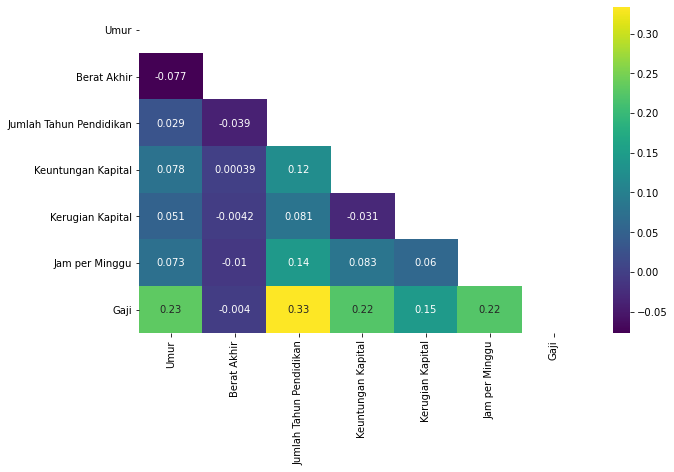

# Neural Network Model to Predict One's Salary Category: Project Overview
* Created a neural network model to classify one's salary category.
* Feature engineering on some features to group by categories.
* Selection on features which has low correlation to target.
* Found the best model by customizing model's layers.

# Resources Used
* Python Version=3.7
* Packages: NumPy, pandas, matplotlib, TensorFlow, Keras, sklearn.
* Data: https://www.kaggle.com/c/sanbercode-data-science/data

# Data Cleaning
I did some changes on column names and types. I fixed the column names to improve readility. I changed the `ID` column to as object because it is does not have any meaning when dealing with mathematical computations. I also made new categorization on `Pendidikan` column because there are categories can be combined into a category.

# Exploratory Data Analysis
I looked at the distributions of the data and the value counts for the various categorical variables. Below are a few highlights.

From the visualization above, I can concluded that the longer a person learns, the greater the chance of a salary above 5 million rupiahs. Also it is said that `Berat Akhir` has the lowest correlation to `Gaji`.If people married, their chance to get higher salary is greater. The majority of data I used is dominated by high school person.

# Model Building
I one-hot encoded all category features to make it numeric and can be accepted by the model. I also pulled out features that have no relationship to target. I split the data into two parts: training and validation data with a proportion of 70:30 using `train_test_split`. At first, I build a simple neural network sequential model with three hidden layers with 10 nodes each. The second model is as the same as the previous one, except I insert normalization layers between hidden layers. Here are the visualization of the models I made.

I evaluated the model by choosing AUC as the model's metric as this is a binary class problem.

# Model Performance
The first model give ...., while the second model ... so I chose the first/second model for predicting the unseen data.

# Prediction
On [Kaggle](https://www.kaggle.com/c/sanbercode-data-science/leaderboard) late submission leaderboard, I got a score of .... for AUC metric.
